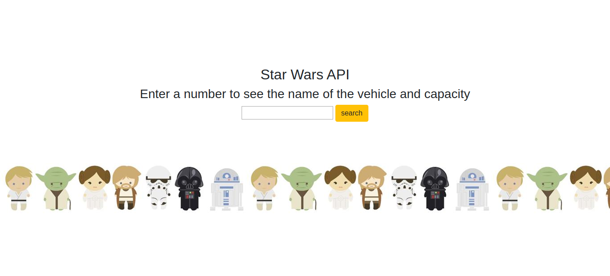
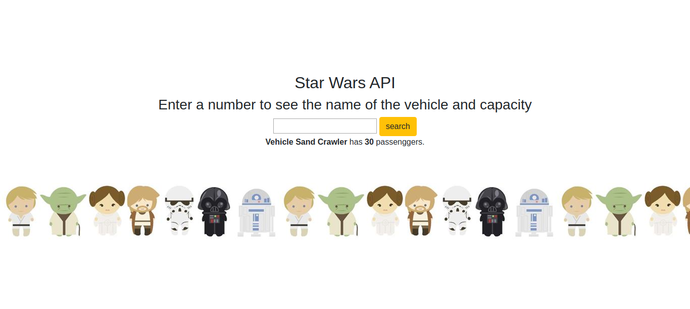

# Rest_api

Small project to demonstrate Django REST functionality, I used the free Star Wars API to display some data.

 ## The App was built with: 
 Django, Python3, HTML, REST, Bootstrap
 
 

 
